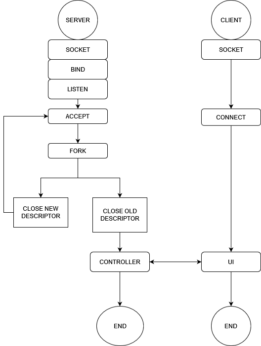

# Server Tester

A grade-A project for the *Computer Networks* course (2022).  
Server testing tool with support for FTP, HTTP, and custom services.  
Includes latency checks, functional tests, and a simple client-server architecture.

Designed for academic purposes.

